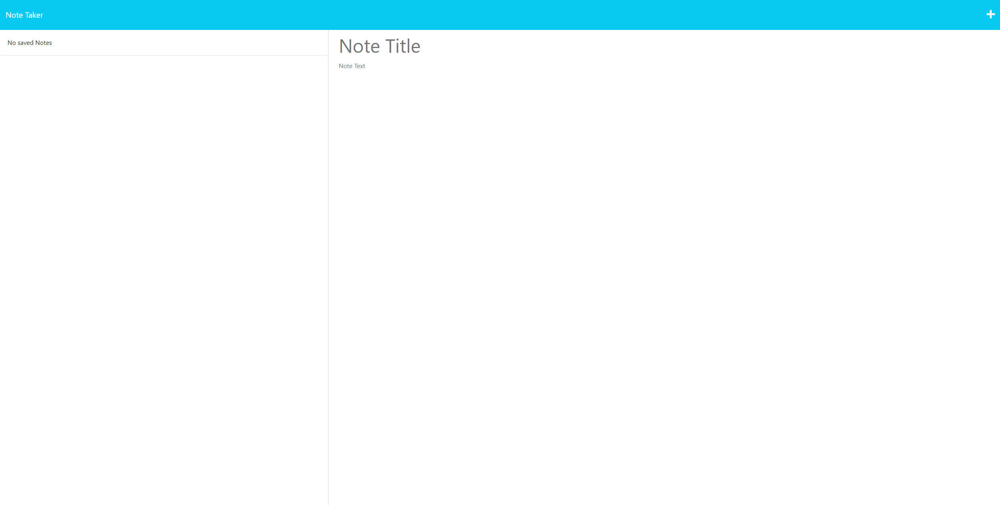
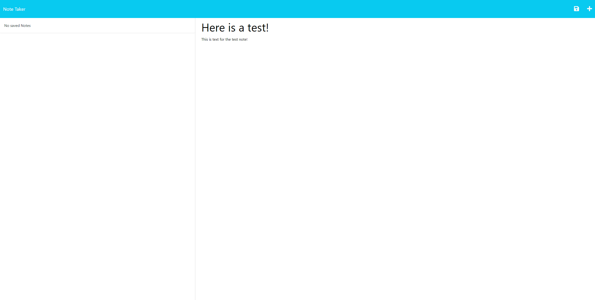
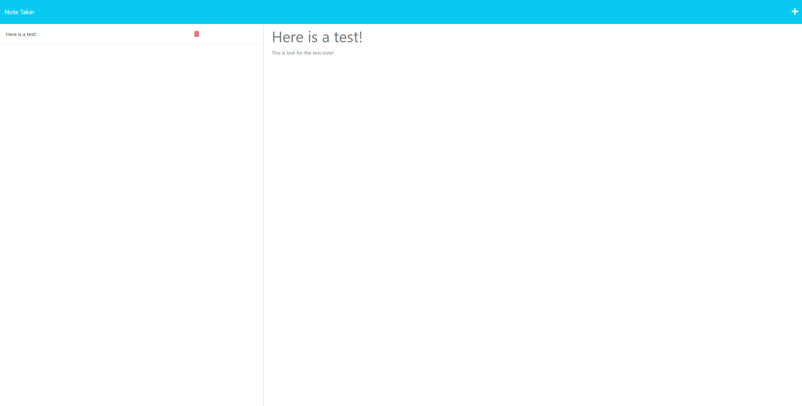

# Note-Taker

## Description

This application can be used to write, save, and delete notes. This application uses an express backend and saves and retrieves note data from a JSON file.

## Table of Contents

* [Installation](#installation)

* [Usage](#usage)

* [Questions](#questions)

## Installation

To install necessary dependencies, run the following command:

```
npm install express
```

## Usage

To use the application, run the following command:

```
node server.js
```

Then open your browser and go to localhost:3001 to use the application. You can also use the deployed application at https://note-taker-dww.herokuapp.com/.









## Questions

If you have any questions about the repo, open an issue or contact me directly at <a href="mailto:donovanw.walker@gmail.com">my email</a>.
